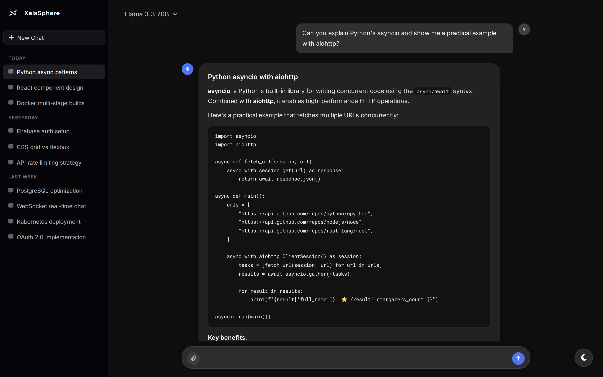
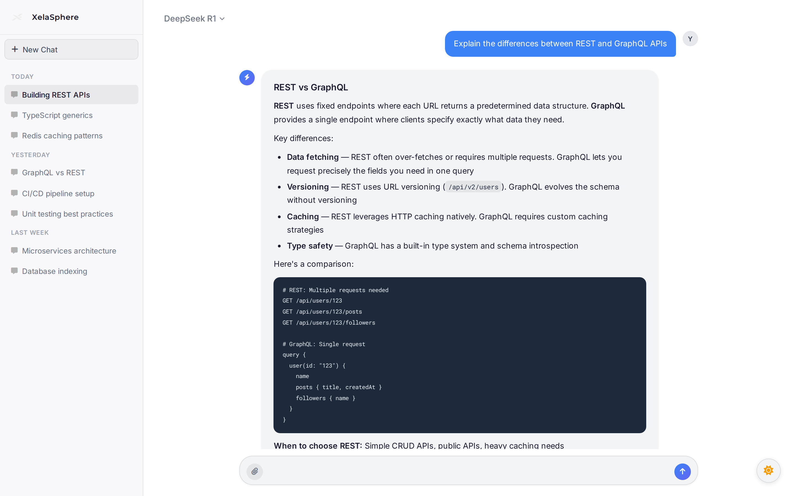
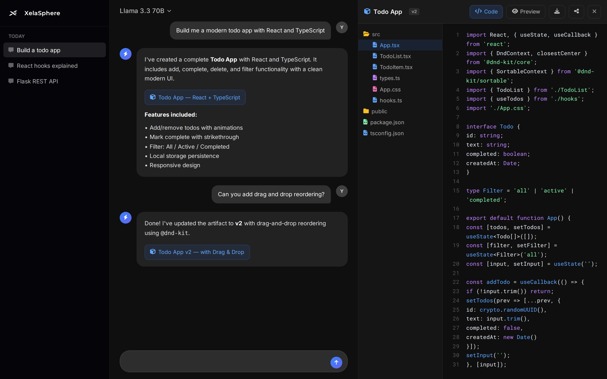
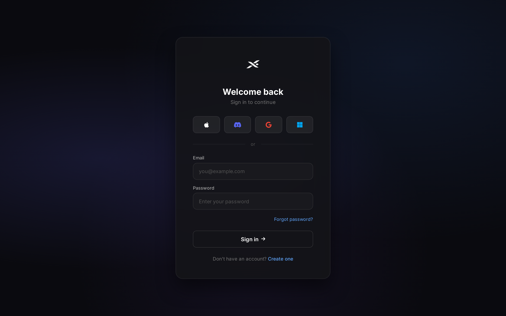
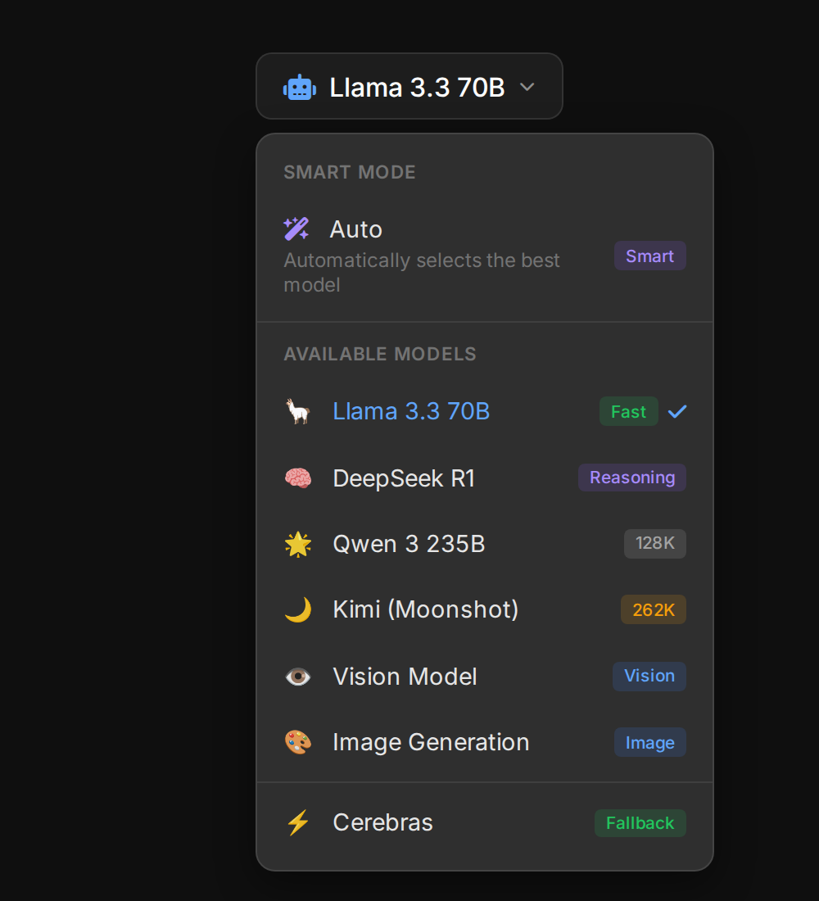
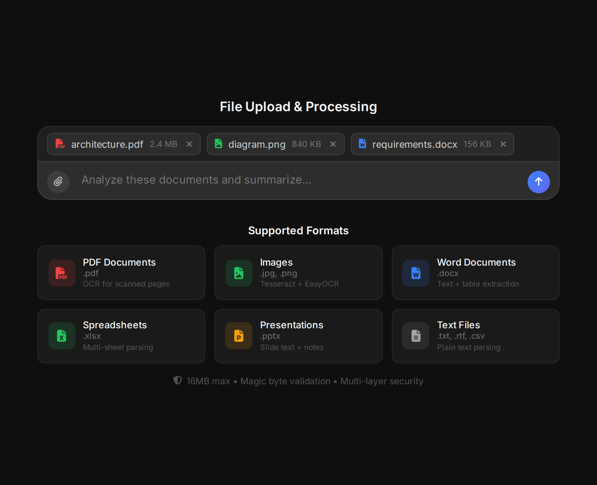
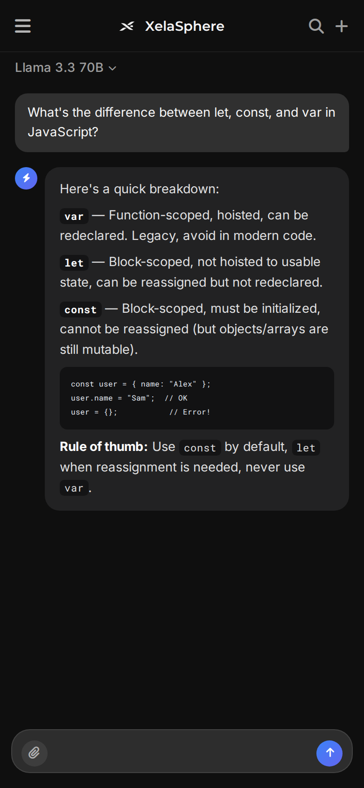
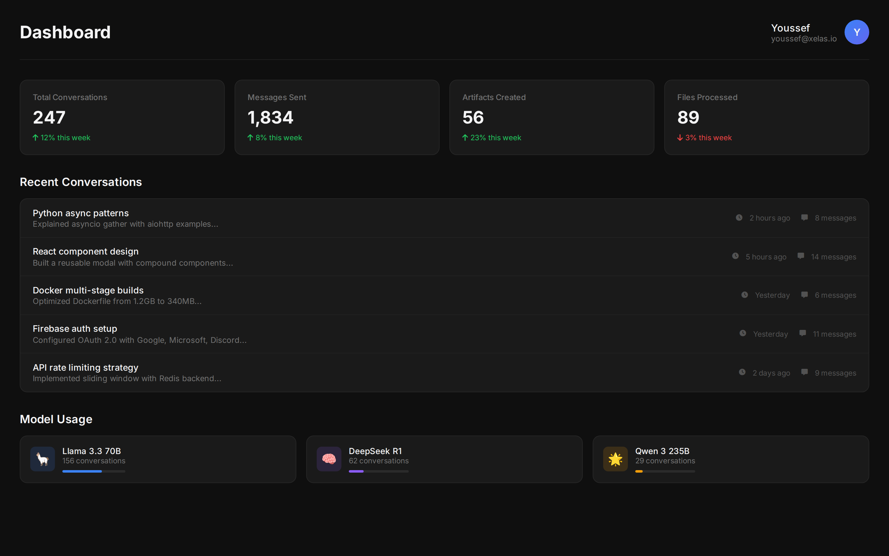
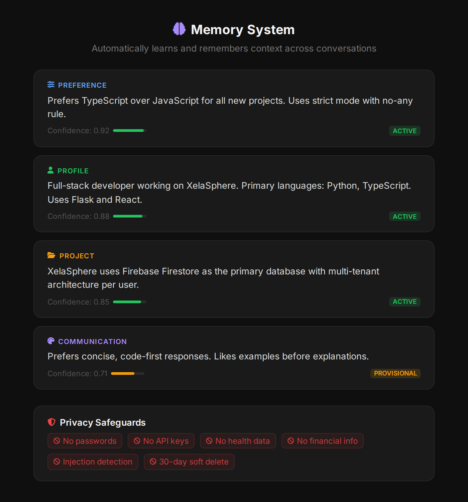

<p align="center">
  
</p>

<h1 align="center">XelaSphere</h1>

<p align="center">
  <strong>A production-grade AI chat platform with multi-model orchestration, artifacts, memory, and intelligent file processing.</strong>
</p>

<p align="center">
  
  
  
  
  
  
  
</p>

<p align="center">
  <a href="#-screenshots">Screenshots</a> &bull;
  <a href="#-features">Features</a> &bull;
  <a href="#-tech-stack">Tech Stack</a> &bull;
  <a href="#-architecture">Architecture</a> &bull;
  <a href="#-ai-models">AI Models</a> &bull;
  <a href="#-security">Security</a>
</p>

---

## Screenshots

### Chat Interface — Dark Mode
<p align="center">
  
</p>

> Full-featured chat with streaming responses, markdown rendering, LaTeX math, code highlighting, and file attachments.

### Chat Interface — Light Mode
<p align="center">
  
</p>

### Artifacts Panel — Code Generation & Preview
<p align="center">
  
</p>

> Claude-style artifact system with file tree navigation, syntax highlighting, live HTML preview in a sandboxed iframe, version history, and one-click ZIP download.

### Artifact Versioning & File Tree

> The artifact panel supports full version history (v1, v2, v3...) with file-level navigation, as shown in the Code tab above. Switch between versions, download as ZIP, or share via token-based public links.

### Authentication — Multi-Provider OAuth
<p align="center">
  
</p>

> Sign in with Google, Microsoft, or Discord — or register with email. Guest mode available for anonymous sessions.

### Model Selector — 10+ AI Models
<p align="center">
  
</p>

> Choose from Llama 3.3 70B, DeepSeek R1, Qwen 3, and more — or let Smart Router auto-select the best model for your task.

### File Upload & OCR Processing
<p align="center">
  
</p>

> Upload PDFs, images, Word docs, Excel spreadsheets, and PowerPoint files. Scanned documents are auto-OCR'd with Tesseract + EasyOCR fallback.

### Mobile Responsive Design
<p align="center">
  
</p>

> Fully responsive with swipe gestures, collapsible sidebar, and touch-optimized controls.

### Dashboard
<p align="center">
  
</p>

### Memory System in Action
<p align="center">
  
</p>

> Automatically learns and remembers user preferences, project context, and profile details across conversations — with confidence thresholds and privacy safeguards.

---

## Features

### Core Chat
- **Streaming AI responses** with real-time token rendering and abort support
- **Markdown rendering** via markdown-it with task lists, smart typography, and auto-linking
- **LaTeX math** with KaTeX (inline `$...$` and display `$$...$$`)
- **Code highlighting** with Prism.js and 20+ language support
- **Mermaid diagrams** rendered inline from chat responses
- **File & image attachments** with drag-and-drop, preview thumbnails, and inline display
- **Message actions** — edit, delete, copy, and quote any message
- **Keyboard shortcuts** — `Ctrl+Enter` to send, `Ctrl+K` to search sessions

### Artifacts System
- **Claude-style side panel** for generated code, projects, and documents
- **File tree view** with collapsible directories and syntax-highlighted editors (CodeMirror)
- **Live preview** — HTML renders in a sandboxed iframe, Markdown renders with styling
- **Version history** — browse v1, v2, v3... with full file-level diffs
- **Download as ZIP** — export any artifact version as a complete project
- **Shareable links** — token-based public access for sharing artifacts externally
- **Comments** — add notes and annotations to artifacts

### Intelligent Model Routing
- **Smart Router** — automatically selects the optimal model based on:
  - Task type (coding, reasoning, creative writing, vision)
  - Conversation length (switches to long-context models as needed)
  - Content analysis (routes to appropriate model on refusal detection)
- **Manual override** — pick any model from the dropdown
- **Circuit breaker pattern** — prevents cascading failures when an API provider is down
- **Ranked fallback chains** — Groq → Cerebras for uninterrupted service

### Memory System (v2 + v3)
- **Automatic extraction** of user preferences, profile facts, and project context
- **Confidence thresholds** (0.60–0.90) with promotion from PROVISIONAL → ACTIVE
- **Privacy safeguards** — never stores passwords, API keys, health data, or financial info
- **Injection detection** — blocks prompt-poisoning attempts in memory content
- **Soft delete** with 30-day retention and supersede tracking for corrections
- **Rate limits** — 3 memories/message, 10/day to prevent noise
- **V3 adaptive layer** — A/B testing behavioral signals without persistent storage

### File Processing Pipeline
- **PDF** — text extraction with OCR fallback for scanned pages
- **Images** (JPG, PNG) — Tesseract OCR with EasyOCR fallback, pre-processed for accuracy (greyscale, upscaling, contrast enhancement)
- **Word documents** (.docx) — full text + table extraction
- **Excel spreadsheets** (.xlsx) — sheet-aware data parsing
- **PowerPoint** (.pptx) — slide text and notes extraction
- **RTF documents** — rich text parsing
- **Multi-layer validation** — MIME type → file extension → magic bytes → content parsing
- **16MB size limit** with per-type restrictions

### Web Search & Data
- **Brave Search** integration with TF-IDF relevance scoring
- **Domain blocklist** with regex filtering
- **Cryptocurrency prices** — CoinGecko + CoinPaprika + Binance fallback chain (30+ coins)
- **Stock news** — Finnhub integration for market data
- **Caching** — 1-hour TTL with exponential backoff on rate limits
- **Prometheus metrics** for search observability

### Authentication & Security
- **OAuth 2.0** — Google, Microsoft, Discord with PKCE
- **Email/password** registration with Firebase Auth
- **Guest mode** — anonymous chat without account creation
- **Session management** — Firestore-backed with 7-day TTL
- **Encrypted API key storage** — users can bring their own keys
- **Password reset** via email

### UI/UX
- **Dark/light theme** — system preference detection, manual toggle, 300ms smooth transitions, 40+ CSS design tokens
- **Responsive design** — optimized breakpoints for phone (≤512px), tablet, and desktop
- **Mobile gestures** — swipe-to-delete in chat history
- **32 modular CSS stylesheets** with a design-tokens system
- **Toast notifications** — contextual success/error/warning messages
- **Sidebar** with searchable chat history, pinning, and archiving
- **Voice mode** — speech synthesis and dictation support
- **FOUC prevention** — theme pre-loaded from localStorage before DOM renders

---

## Tech Stack

### Backend
| Technology | Purpose |
|---|---|
| **Python 3.11** | Runtime |
| **Flask 3.1** | Web framework with blueprint-based modular architecture |
| **Gunicorn** | Production WSGI server (2 workers × 4 threads) |
| **Firebase Firestore** | NoSQL database (multi-tenant, serverless) |
| **Firebase Auth** | Identity management + OAuth provider integration |
| **Firebase Cloud Storage** | File uploads and generated image storage |
| **sentence-transformers** | Embeddings (Jina v3, MiniLM) for hybrid retrieval |
| **scikit-learn** | TF-IDF vectorization for search relevance scoring |
| **NLTK** | Language-aware text chunking and tokenization |
| **PyTorch (CPU)** | Inference runtime for embedding models |
| **Tesseract + EasyOCR** | Dual OCR engines with automatic fallback |
| **PyPDF2 / PIL** | PDF and image processing pipeline |
| **python-docx / openpyxl** | Office document parsing |
| **Bleach / DOMPurify** | HTML sanitization (server + client) |
| **Flask-Limiter** | Rate limiting per user/endpoint |
| **Prometheus** | Metrics collection and monitoring |

### Frontend
| Technology | Purpose |
|---|---|
| **Vanilla JavaScript** | 2,200+ lines — no framework overhead |
| **Jinja2** | Server-side templating |
| **markdown-it** | Markdown rendering with task lists plugin |
| **KaTeX** | LaTeX math rendering |
| **Prism.js** | Syntax highlighting (20+ languages) |
| **CodeMirror 5** | In-browser code editor for artifacts |
| **Mermaid** | Diagram rendering from markdown |
| **Font Awesome 6** | Icon library |
| **Manrope + Roboto Mono** | Typography (UI + code) |
| **CSS Custom Properties** | Design token system with theme switching |

### Infrastructure & DevOps
| Technology | Purpose |
|---|---|
| **Docker** | Multi-stage containerization with pre-warmed models |
| **Google Cloud Run** | Serverless deployment with 300s timeout |
| **Cloud Build** | CI/CD pipeline |
| **pytest + pytest-cov** | Testing with coverage reporting |
| **CSRFProtect** | Cross-site request forgery prevention |
| **Rotating File Logs** | 10MB × 10 backup concurrent logging |

### AI Model Providers
| Provider | Models | Use Case |
|---|---|---|
| **Groq** | Llama 3.3 70B, Qwen 3 235B, Llama Guard 3 | Primary inference, content safety |
| **DeepSeek** | DeepSeek R1 | Deep reasoning tasks |
| **OpenRouter** | Vision models, image generation | Multi-modal capabilities |
| **Moonshot/Kimi** | Long-context reasoning | 128K+ token conversations |
| **Cerebras** | Fallback models | High-availability fallback |

---

## Architecture

### System Overview

```
┌─────────────────────────────────────────────────────────────────┐
│                        CLIENT (Browser)                         │
│  ┌──────────┐  ┌──────────┐  ┌──────────┐  ┌───────────────┐  │
│  │  Chat UI  │  │ Artifacts│  │  Sidebar │  │ Theme Engine  │  │
│  │ markdown  │  │ CodeMirr │  │  Search  │  │ 40+ tokens    │  │
│  │ KaTeX     │  │ Preview  │  │  History │  │ localStorage  │  │
│  │ Prism.js  │  │ File Tree│  │  Pinning │  │ system-pref   │  │
│  └────┬─────┘  └────┬─────┘  └────┬─────┘  └───────────────┘  │
│       │              │              │                            │
│       └──────────────┼──────────────┘                            │
│                      │  SSE Streaming + REST API                 │
└──────────────────────┼───────────────────────────────────────────┘
                       │
┌──────────────────────┼───────────────────────────────────────────┐
│                 FLASK APPLICATION                                │
│                      │                                           │
│  ┌───────────────────┴────────────────────┐                     │
│  │           Blueprint Router              │                     │
│  │  /chat  /artifacts  /upload  /auth      │                     │
│  │  /memory  /session  /account  /search   │                     │
│  └───┬──────┬──────┬──────┬──────┬────────┘                     │
│      │      │      │      │      │                               │
│  ┌───┴──┐ ┌─┴───┐ ┌┴────┐ ┌┴───┐ ┌┴──────┐                    │
│  │Smart │ │Arti-│ │File │ │Auth│ │Memory │                      │
│  │Router│ │facts│ │Proc.│ │    │ │ V2+V3 │                      │
│  │      │ │Parse│ │OCR  │ │OAuth│ │Extract│                     │
│  │Circuit│ │Store│ │Valid.│ │CSRF│ │Guard  │                     │
│  │Breaker│ │Vers.│ │Magic│ │    │ │Promote│                     │
│  └───┬──┘ └──┬──┘ └──┬──┘ └─┬──┘ └───┬───┘                    │
│      │       │       │      │        │                           │
│  ┌───┴───────┴───────┴──────┴────────┴───┐                      │
│  │         Service Layer                  │                      │
│  │  Embeddings (Jina v3 + MiniLM)        │                      │
│  │  TF-IDF Scoring  │  TTL Caching       │                      │
│  │  Search Client   │  Crypto API        │                      │
│  └───────────────────┬───────────────────┘                      │
│                      │                                           │
└──────────────────────┼───────────────────────────────────────────┘
                       │
        ┌──────────────┼──────────────┐
        │              │              │
   ┌────┴────┐   ┌────┴────┐   ┌────┴────┐
   │ Firebase │   │   AI    │   │ Search  │
   │Firestore │   │ Models  │   │  APIs   │
   │  Auth    │   │ Groq    │   │ Brave   │
   │ Storage  │   │DeepSeek │   │CoinGecko│
   │          │   │OpenRouter│  │Finnhub  │
   └─────────┘   └─────────┘   └─────────┘
```

### Key Architectural Patterns

**Blueprint Modularization** — 10 Flask blueprints isolate concerns (chat, artifacts, memory, auth, upload, session, account, weather, email, media), each with independent routes and logic.

**Smart Model Router** — Analyzes conversation context, detects task type (coding, reasoning, vision, creative), and dynamically selects the optimal model. Includes circuit breaker to prevent cascading failures.

**Hybrid Retrieval** — Combines dense vector search (sentence-transformer embeddings) with sparse keyword matching (TF-IDF) for memory queries and search ranking.

**Multi-Layer File Validation** — Every upload passes through MIME type check → extension allowlist → magic byte verification → content-specific parsing, preventing upload-based attacks.

**Graceful Degradation** — Crypto prices cascade through CoinGecko → CoinPaprika → Binance. OCR falls back from Tesseract → EasyOCR. Models fall back from Groq → Cerebras. The app never hard-fails.

**Memory Orchestration** — V2 handles production extraction with confidence scoring, quarantine, and promotion rules. V3 is an adaptive signals-only layer for A/B testing behavioral changes without persisting data.

### Data Flow — Chat Message

```
User types message
       │
       ▼
  ┌─────────┐    ┌──────────┐    ┌──────────────┐
  │ Validate │───▶│  Smart   │───▶│ Build Prompt │
  │  CSRF    │    │  Router  │    │  + Memory    │
  │  Rate    │    │  Select  │    │  + Files     │
  │  Limit   │    │  Model   │    │  + Search    │
  └─────────┘    └──────────┘    └──────┬───────┘
                                        │
                                        ▼
                                 ┌──────────────┐
                                 │   LLM API    │
                                 │  (Streaming) │
                                 └──────┬───────┘
                                        │
                          ┌─────────────┼──────────────┐
                          ▼             ▼              ▼
                   ┌───────────┐ ┌───────────┐ ┌────────────┐
                   │  Render   │ │  Extract  │ │   Parse    │
                   │  Markdown │ │  Memory   │ │  Artifacts │
                   │  + Math   │ │  Items    │ │  + Store   │
                   └───────────┘ └───────────┘ └────────────┘
```

### Docker Build

```dockerfile
# Multi-stage build with pre-warmed embedding models
Python 3.11 Slim → System deps (Tesseract, fonts)
  → pip install (55+ packages)
  → Pre-download Jina v3 + MiniLM embeddings
  → Gunicorn (2 workers × 4 threads, port 5001)
```

---

## AI Models

XelaSphere orchestrates **10+ AI models** across multiple providers, automatically routing each request to the optimal model:

| Model | Provider | Context | Best For |
|---|---|---|---|
| Llama 3.3 70B | Groq | 128K | General chat, coding |
| Qwen 3 235B A22B | Groq | 128K | Complex reasoning |
| DeepSeek R1 | DeepSeek | 64K | Deep analysis, math |
| Llama Guard 3 8B | Groq | 8K | Content safety moderation |
| Kimi (Moonshot) | Moonshot | 262K | Ultra-long conversations |
| Vision Models | OpenRouter | Varies | Image understanding |
| Image Generation | OpenRouter | — | AI art generation |
| Cerebras Models | Cerebras | 8K | High-speed fallback |

The **Smart Router** uses task detection heuristics to auto-select models:
- **Coding tasks** → Llama 3.3 70B (fast, accurate)
- **Deep reasoning** → DeepSeek R1 (chain-of-thought)
- **Long conversations** → Kimi 262K context
- **Image input** → Vision models via OpenRouter
- **Content safety** → Llama Guard pre-screening

---

## Security

XelaSphere implements defense-in-depth security:

| Layer | Implementation |
|---|---|
| **Authentication** | Firebase Auth + OAuth 2.0 (PKCE) with session TTL |
| **CSRF** | Flask-CSRFProtect with token validation on all state-changing requests |
| **XSS Prevention** | Server-side Bleach sanitization + client-side DOMPurify |
| **CSP Headers** | Strict Content-Security-Policy with no unsafe-eval (except marked CDNs) |
| **HTTP Headers** | X-Frame-Options DENY, X-Content-Type-Options nosniff, Referrer-Policy |
| **Rate Limiting** | Per-user, per-endpoint limits (Flask-Limiter) |
| **File Validation** | MIME + extension + magic byte triple-check |
| **Memory Safety** | Injection pattern detection, no sensitive data storage, confidence gates |
| **API Keys** | Encrypted at rest in Firestore, never logged or exposed |
| **Cookies** | SameSite=Lax, Secure flag in production, HttpOnly |

---

## Project Structure

```
xelasphere/
├── app/
│   ├── views.py              # Core chat logic (6,500 lines)
│   ├── auth.py               # OAuth + Firebase Auth (47KB)
│   ├── artifacts.py          # Artifact parsing & versioning (68KB)
│   ├── config.py             # Flask + Firebase initialization
│   ├── smart_router.py       # Intelligent model selection
│   ├── grog_api.py           # LLM API with circuit breaker
│   ├── crypto_api.py         # Multi-provider crypto prices (84KB)
│   ├── search_client.py      # Brave Search + TF-IDF scoring
│   ├── memory_v2/            # Production memory system
│   │   ├── orchestrator.py   # Memory extraction pipeline
│   │   ├── extractor.py      # Entity & preference extraction
│   │   ├── safeguards.py     # Privacy & injection guards
│   │   └── storage.py        # Firestore persistence
│   ├── memory_v3/            # Adaptive behavior layer
│   │   ├── signals.py        # A/B testing signals
│   │   └── rollout.py        # Feature rollout management
│   ├── blueprints/           # 10 modular route blueprints
│   │   ├── chat_routes.py
│   │   ├── artifacts_routes.py
│   │   ├── memory_routes.py
│   │   ├── upload_routes.py
│   │   ├── session_routes.py
│   │   ├── account_routes.py
│   │   └── ...
│   ├── services/             # External service integrations
│   ├── static/
│   │   ├── css/              # 32 modular stylesheets
│   │   ├── js/               # 16+ JavaScript modules
│   │   └── images/           # Logos, icons, OAuth provider SVGs
│   └── templates/            # 14 Jinja2 HTML templates
├── tests/                    # pytest suite with coverage
├── Dockerfile                # Multi-stage production build
├── cloudbuild.yaml           # Google Cloud Build CI/CD
├── requirements-cpu.txt      # 55+ Python dependencies
└── firestore.rules           # Database security rules
```

---

## Performance

- **Embedding models pre-loaded** in Docker image — zero cold-start latency for semantic search
- **Gunicorn** with 2 workers × 4 threads = 8 concurrent requests per instance
- **TTL caching** on search results, embeddings, and model responses
- **Lazy loading** — heavy ML models initialize only on first use
- **Image preprocessing** — greyscale conversion, upscaling, and contrast enhancement for OCR accuracy
- **FOUC prevention** — theme loaded from localStorage before first paint
- **ThreadPoolExecutor** for concurrent file processing
- **SSE streaming** — tokens render as they arrive, no waiting for full response

---

## Deployment

XelaSphere is containerized and deployed on **Google Cloud Run** with:

- **Docker** multi-stage build with pre-warmed embedding models
- **Cloud Build** for automated CI/CD on push
- **Firestore** for zero-ops, auto-scaling database
- **Firebase Cloud Storage** for file uploads
- **300s request timeout** accommodating model cold starts
- **Prometheus metrics** endpoint for monitoring

---

<p align="center">
  <strong>Built by <a href="https://github.com/xelauvas">xelauvas.dev</a></strong>
</p>

<p align="center">
  <sub>This repository contains only documentation. Source code is proprietary.</sub>
</p>
